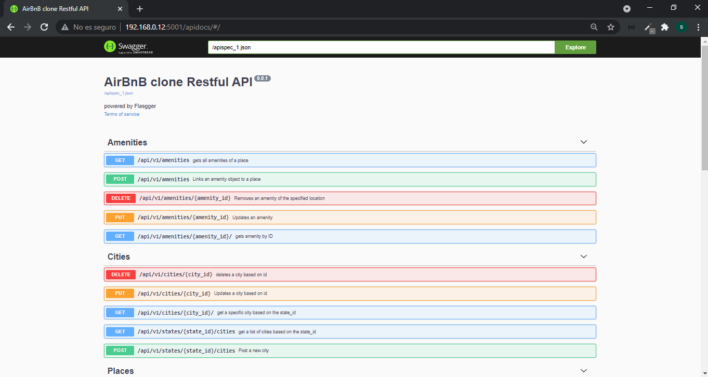
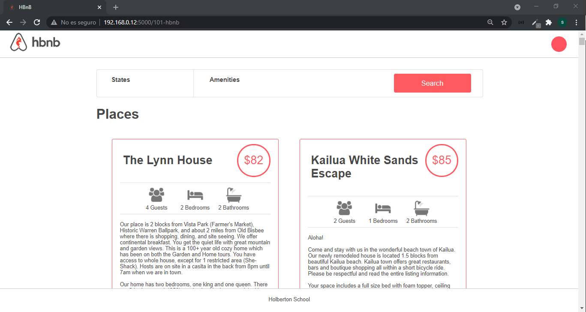
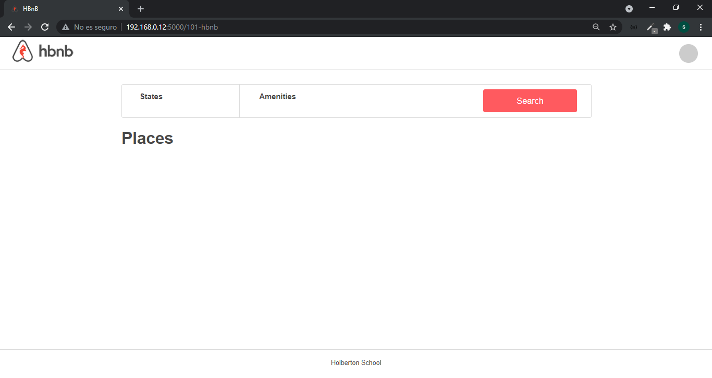
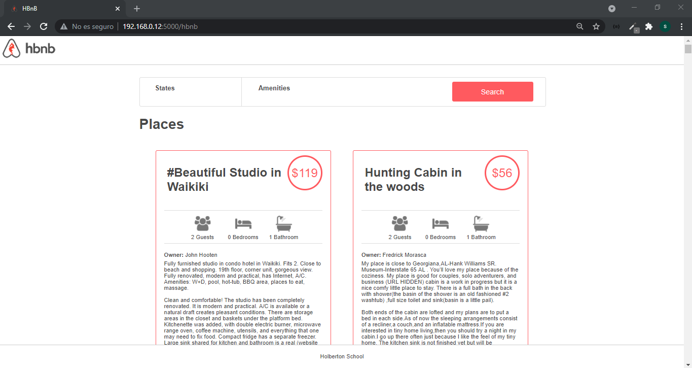
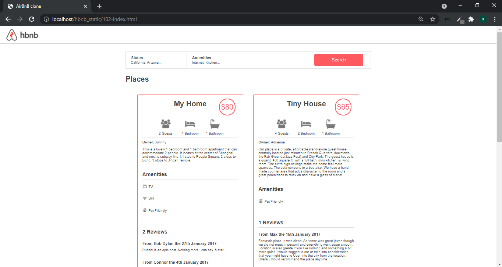

# AirBnB Clone
<p align="center">
  
</p>

## Description  
This project cover fundamental concepts of higher level programming. The goal is to eventually deploy a server with a clone of the web application of the popular digital platform dedicated to the supply of accommodation AirBnB. Built in Phyton (Flask), HTML, CSS JavaScript(jQuery) and MySQL.

<p align="center">
  
</p>

This is the final result of a project that was carried out from scratch in four parts, although for each part except the first a code base developed by other Holbertonschool colleagues was used.
* [AirBnB_clone_v3](https://github.com/santiagopemo/AirBnB_clone_v3)
* [AirBnB_clone_v2](https://github.com/santiagopemo/AirBnB_clone_v2)
* [AirBnB_clone](https://github.com/santiagopemo/AirBnB_clone)

## Table of Content
* [Environment](#environment)
* [Installation](#installation)
* [File Descriptions](#file-descriptions)
* [Usage](#usage)
* [Examples of use](#examples-of-use)
* [Bugs](#bugs)
* [Authors](#authors)
* [License](#license)

## Environment
This project was interpreted/tested on Ubuntu (20.04.1 LTS) using python3  (3.8.5), and MySql (8.0.25)

## Installation
* First you must have a my sql and python3 database server installed:  
**MySql:** [Install MySQL Server on the Ubuntu operating system](https://docs.rackspace.com/support/how-to/install-mysql-server-on-the-ubuntu-operating-system/)  
**Python 3:** [How to Install Python 3 on Ubuntu 18.04 or 20.04](https://phoenixnap.com/kb/how-to-install-python-3-ubuntu)  
* Clone this repository:  
```
$ git clone "https://github.com/santiagopemo/AirBnB_clone_v4"
```
* Access to the AirBnb_clone_v4 directory:  
```
$ cd AirBnb_clone_v4
```
* Once you have installed python3 install all pip3 dependencies in the [requirements.txt](./requirements.txt) file: 
```
$ pip3 install -r requirements.txt
```
### Setting up the database
* Once you have installed the MySQL-server make sure to have the service running:
```
$ sudo service mysql start
```
* Run the commands in the [setup_mysql_dev.sql](./setup_mysql_dev.sql) file to prepare the development database:
```
cat setup_mysql_dev.sql | sudo mysql
```
or
```
cat setup_mysql_dev.sql | mysql -hlocalhost -uroot -p
```
**Note:** The operation of the two previous commands depend on how you have configured your mysql server, in general terms these commands work with the default configuration.

### Populate the database
Files [7-dump.sql](./7-dump.sql), [10-dump.sql](./10-dump.sql) and [100-dump.sql](./100-dump.sql) have SQL statements that you can run to populate the database:
```
cat 100-dump.sql | sudo mysql
```
or
```
cat 100-dump.sql | mysql -hlocalhost -uroot -p
```
**Note:** The operation of the two previous commands depend on how you have configured your mysql server, in general terms these commands work with the default configuration.

## Usage
Assuming that all the steps of the installation were completed successfully, you can use the application in the following way
### Environment Variables
The following are the environment variables necessary to run the application  
* HBNB_ENV: running environment. It can be “dev” or “test”
* HBNB_MYSQL_USER: the username of your MySQL
* HBNB_MYSQL_PWD: the password of your MySQL
* HBNB_MYSQL_HOST: the hostname of your MySQL
* HBNB_MYSQL_DB: the database name of your MySQL
* HBNB_TYPE_STORAGE: the type of storage used. It can be “file” (using FileStorage) or db (using DBStorage)
### API
[api/](./api/)  
To run the API simply enter the following command  
```
$ HBNB_MYSQL_USER=hbnb_dev HBNB_MYSQL_PWD=hbnb_dev_pwd HBNB_MYSQL_HOST=localhost HBNB_MYSQL_DB=hbnb_dev_db HBNB_TYPE_STORAGE=db HBNB_API_PORT=5001 python3 -m api.v1.app
```
**Note:** As you can see, the previous command was executed with a series of environment variables which may vary depending on the configuration of your environment, by default Flask aplications runs in port 5000, but since it is necessary to deploy a server for the api and another for the views, we run it on port 5001 using the environment variable HBNB_API_PORT=5001  
  
Once the API is launched, you can access its documentation at endpoint `/apidocs/`
<p align="center">
  
</p>

### Web Dynamic
[web_dynamic/](./web_dynamic/)  
To run the dynamic views simply enter the following command  
```
$ HBNB_MYSQL_USER=hbnb_dev HBNB_MYSQL_PWD=hbnb_dev_pwd HBNB_MYSQL_HOST=localhost HBNB_MYSQL_DB=hbnb_dev_db HBNB_TYPE_STORAGE=db python3 -m web_dynamic.101-hbnb
```
Once you launch the server you can go to the endpoint `/101-hbnb/`to see the view. The content depends on whether the API described in the previous step is working correctly or not. If the point in the upper right corner is red it means that a connection with the API could be established, if it is gray instead, it means the opposite.
<p align="center">
  
  
</p>

### Web Flask
[web_flask/](./web_flask/)  
It is also possible to deploy an oriented server based on a monolithic architecture, unlike the previous two, oriented to services, running the following command:
```
HBNB_MYSQL_USER=hbnb_dev HBNB_MYSQL_PWD=hbnb_dev_pwd HBNB_MYSQL_HOST=localhost HBNB_MYSQL_DB=hbnb_dev_db HBNB_TYPE_STORAGE=db python3 -m web_flask.100-hbnb
```
Once you launch the server you can go to the endpoint `/hbnb/`to see the web site.
<p align="center">
  
</p>

**Note:** By default Flask runs its applications on port 5000, so it is recommended to deactivate the server in the previous point before deploying this, or change the port.
## Web Static
Another version of this project is displaying static content which can be seen in the [web_static/](./web_static/) folder.  
In addition to the static content, different programs were made to deploy it on remote servers using Bash scripts and Python scripts with Fabric
### Deployment
To make the deployment you first need to access the server create a new user called `ubuntu` and run the script [0-setup_web_static.sh](./0-setup_web_static.sh)
```
$ sudo adduser ubuntu
```
```
$ ./0-setup_web_static.sh
```

This script will install the NGINX web server and configure it to run the application creating the necessary directories for it.  

Once the servers on which you want to perform the deployment have been configured, execute the script [3-deploy_web_static.py](./3-deploy_web_static.py) using Fabric, that creates and distributes an archive to the web servers  .

Before executing the script, you must place the IP addresses of the servers to which you want to distribute the new file, for this you must enter the file [3-deploy_web_static.py](./3-deploy_web_static.py), in line 10 in the variable `env.host` and assign a list with the IPs , by default this variable has assigned IP addresses which must be changed.
```
10  env.hosts = ['<your server IP address>', '<your other server IP address>', ....]
```

Once the IP addresses have been set, the script is executed with Fabric
```
$ fab -f 3-deploy_web_static.py deploy -i <my_ssh_private_key> -u ubuntu
```
where `<my_ssh_private_key>` is the private key to access your servers via SSH  

This command will generate a directory called `/versions/` in which the files generated with the name `web_static_<year><month><day><hour><minute><second>.tgz` will be found.  

Once the previous steps have been carried out, the content can be viewed by accessing the url `http://<your_server_IP>/hbnb_static/102-index.html`.  
<p align="center">
  
</p>

## Console
One of the main features of this project is its console from which you can test the application's backend
to access it, you must first be at the root of the project and execute the [console.py](./console.py) file
```
$ ./console.py
```
In this way, only the file storage type works, which generates a file in which all the information is stored locally, if you want to access the information in the database, the following environment variables must be added , as it's shown in the following  

```
$ HBNB_MYSQL_USER=hbnb_dev HBNB_MYSQL_PWD=hbnb_dev_pwd HBNB_MYSQL_HOST=localhost HBNB_MYSQL_DB=hbnb_dev_db HBNB_TYPE_STORAGE=db ./console.py
```
Once the console command is executed should appear:
```
(hbnb)
```
Here you can type any of the following commands:  
| Command       |              Syntax                                         |     Output                                             |
| :------------ | :---------------------------------------------------------: | -----------------------------------------------------: |
| EOF           | EOF                                                         | Exit interpreter                                       |
| all           | all [class_name]                                            | Displays every instance of class name                  |
| count         | count [class_name]                                          | Counts the instances of specified class                |
| create        | create [class_name]                                         | create a new instance with specified name              |
| destroy       | destroy [class_name] [object_id]                            | Deletes all attributes of class_name.object_id         |
| help          | help [option]                                               | Shows the help for specified option                    |
| quit          | quit                                                        | Exit interpreter                                       |
| show          | show [class_name] [object_id]                               | Displays all attributes                                |
| update        | update [class_name] [object_id] [update_key] [update_value] | Modifies specified attribute                           |


## File Descriptions
[console.py](console.py) - the console contains the entry point of the command interpreter. 
List of commands this console current supports:
* `EOF` - exits console 
* `quit` - exits console
* `<emptyline>` - overwrites default emptyline method and does nothing
* `create` - Creates a new instance of`BaseModel`, saves it (to the JSON file) and prints the id
* `destroy` - Deletes an instance based on the class name and id (save the change into the JSON file). 
* `show` - Prints the string representation of an instance based on the class name and id.
* `all` - Prints all string representation of all instances based or not on the class name. 
* `update` - Updates an instance based on the class name and id by adding or updating attribute (save the change into the JSON file). 

## Examples of use
```
vagrantAirBnB_clone$./console.py
(hbnb) help

Documented commands (type help <topic>):
========================================
EOF  all  create  destroy  help  quit  show  update

(hbnb) all MyModel
** class doesn't exist **
(hbnb) create BaseModel
7da56403-cc45-4f1c-ad32-bfafeb2bb050
(hbnb) all BaseModel
[[BaseModel] (7da56403-cc45-4f1c-ad32-bfafeb2bb050) {'updated_at': datetime.datetime(2017, 9, 28, 9, 50, 46, 772167), 'id': '7da56403-cc45-4f1c-ad32-bfafeb2bb050', 'created_at': datetime.datetime(2017, 9, 28, 9, 50, 46, 772123)}]
(hbnb) show BaseModel 7da56403-cc45-4f1c-ad32-bfafeb2bb050
[BaseModel] (7da56403-cc45-4f1c-ad32-bfafeb2bb050) {'updated_at': datetime.datetime(2017, 9, 28, 9, 50, 46, 772167), 'id': '7da56403-cc45-4f1c-ad32-bfafeb2bb050', 'created_at': datetime.datetime(2017, 9, 28, 9, 50, 46, 772123)}
(hbnb) destroy BaseModel 7da56403-cc45-4f1c-ad32-bfafeb2bb050
(hbnb) show BaseModel 7da56403-cc45-4f1c-ad32-bfafeb2bb050
** no instance found **
(hbnb) quit
```

## Bugs
No known bugs at this time. 

## Authors
Alexa Orrico - [Github](https://github.com/alexaorrico) / [Twitter](https://twitter.com/alexa_orrico)  
Jennifer Huang - [Github](https://github.com/jhuang10123) / [Twitter](https://twitter.com/earthtojhuang)  
Jhoan Zamora - [Github](https://github.com/jzamora5) / [Twitter](https://twitter.com/JhoanZamora10)  
David Ovalle - [Github](https://github.com/Nukemenonai) / [Twitter](https://twitter.com/disartDave)  
Santiago Peña Mosquera - [Github](https://github.com/santiagopemo) / [Twitter](https://twitter.com/Santiag11470161)  
Juan Gomez Rodriguez - [Github](https://github.com/JuanJoseGomezR) / [Twitter](https://twitter.com/J_Gmez)  

## License
Public Domain. No copy write protection. 
